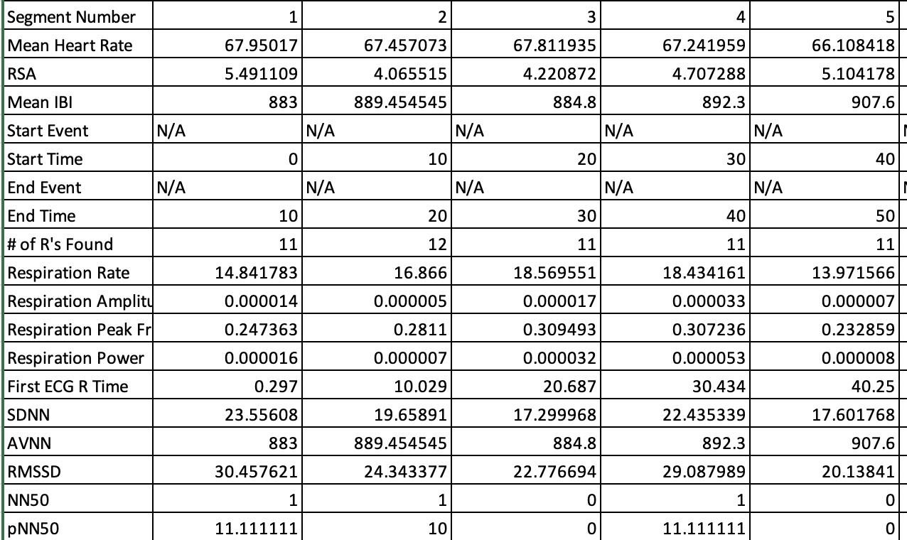
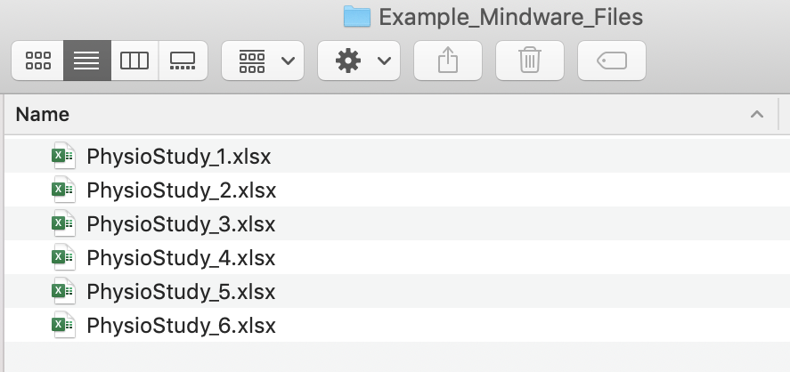
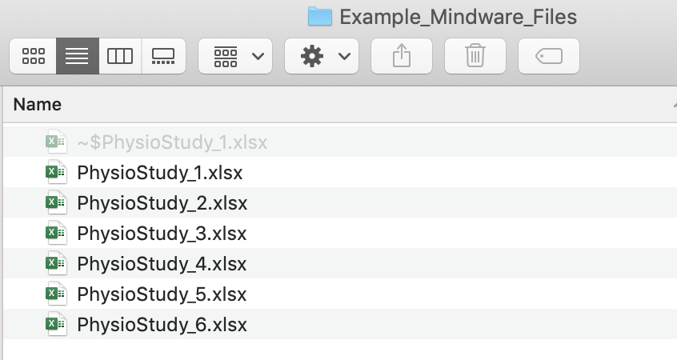

<font size="3">

```{r echo = F}
knitr::opts_chunk$set(message = F, cache = T, warning = F)  
```

<br>


#Introduction 
This demo walks through how to aggregate physiological data files generated by the software package Mindware. Mindware is a popular software that is used to clean and score cardiovascular physiological data. 

In Mindware, each participant's physio file is scored manually, and the resulting values can be output to an Excel file. A time-consuming and potentially error-prone task involves copying the values from each participant's file and pasting them into a master file that aggregates data from all participants. Rather than using this by hand or using Excel macros, we can use R code to accomplish this task. 

This code can be used for aggregating data from Mindware's HRV module, which produces values for measures like heart rate, respiratory sinus arrhythmia, and respiration. 

<br>

#Example Mindware Output File

First, let's take a look at a Mindware Excel output file. Mindware files generally all have a simlar format, which includes the file name. The time points are along the rows, and the specific measures are along the columns. 

```{r echo=FALSE, out.width = '70%', fig.align='center'}

```


<br>

#Folder Set-up

For this code to work, the first step is to create a separate folder that contains only the Mindware Excel files we want to aggregate. 

For our purposes, it is also important that the file name contains the participant ID number, and ideally no other numbers (the inclusion of other numbers may cause issues with pulling out the participant ID number correctly). This is necessary for helping us keep track of which data belong to which person. 

Your resulting folder might look something like this:

```{r echo=FALSE, out.width = '70%', fig.align='center'}

```


<br>

#R Script

First, open up an R script. Set your working directory to the folder you created that contains only the Mindware files. My folder is called `Example_Mindware_Files`. 

```{r, eval = F}
setwd() # add your path to the folder with your data files. 
```

<br>

## Part 1: File Reading Function
We can now set up a function (that I wrote!) called `mw` for Mindware that will pull in the relevant information that we want from each Mindware file. Specifically, this function will copy in each person's ID number, which gets pulled out from the file name, the time point, and the various physiological measures. 

Importantly, this script is configured to put the aggregated data into *long* format. Long format data has each observation on a separate row, as opposed to in separate columns. Long form data is often the data form we need when working with repeated-measures data, like much physiological data. You could reshape our data into wide format if that was your preferred format. 
```{r}
library(dplyr)
library(stringr)
numextract <- function(string){ 
  str_extract(string, "\\-*\\d+\\.*\\d*")
} 

mw <- function (filename) {
    require(readxl)
    require(stringr)
    d <- read_excel(filename)
    names(d) <- NULL
    newd <- data.frame(
      time =  t(as.vector(d[36, 2:ncol(d)])) %>% as.numeric(), 
      hr = t(as.vector((d[37, 2:ncol(d)]))) %>% as.numeric(),
      rsa  = t(as.vector(d[38, 2:ncol(d)])) %>% as.numeric(),
      ibi  = t(as.vector(d[39, 2:ncol(d)])) %>% as.numeric(), 
      rmssd = t(as.vector(d[52, 2:ncol(d)])) %>% as.numeric(), 
      rrate  = t(as.vector(d[45, 2:ncol(d)]))%>% as.numeric(), 
      ramp  = t(as.vector(d[46, 2:ncol(d)])) %>% as.numeric(),
      id = numextract(filename) %>% as.numeric())
    newd <- subset(newd, is.na(time) == F)
  }

```


At this stage, I would recommend testing out the function for a few individual files to make sure it is working properly. 

We could do this for one example file in my folder, `Example_Mindware_Files`. 

```{r, eval = F}
test_mwfile <- mw("PhysioStudy_1.xlsx")
```

```{r, echo = F}
test_mwfile <- mw("/Users/zeekatherine/Desktop/WorkSchool/kzee.github.io/Example_Mindware_Files/PhysioStudy_1.xlsx")
```
```{r}
head(test_mwfile)
```

<br>

## Part 2: Looping Function to Aggregate Data

Once the function is working, we can then set up a second chunk of code that will automatically run the function on every file in the folder we created and put the resulting data into one dataframe. 

```{r, eval = F}
library(plyr)
my_physio_data <- ldply(.data = list.files(pattern="*.xlsx"),
              .fun = mw,
              .parallel = TRUE) 

```


```{r, echo = F}
setwd("/Users/zeekatherine/Desktop/WorkSchool/kzee.github.io/Example_Mindware_Files/")
library(plyr)
my_physio_data <- ldply(.data = list.files(pattern="*.xlsx"),
              .fun = mw,
              .parallel = TRUE) 
```

You may get some warning messages (e.g., `... and XX more problems`). As far as I can tell, these are not real problems and should not be an issue. 

<br>

After running the above, I recommending detaching the `plyr` package, as there can sometimes be an inteference issue when both `dplyr` and `plyr` are loaded at the same time. 
```{r}
detach("package:plyr")
```

<br>

We can then save this data frame to a .csv file (or another file type). And voila! We can share this file with collaborators, use it for analysis, etc. 
```{r, eval = F}
write.csv(my_physio_data, "my_physio_data.csv", row.names = F)
```


<br>


#Some Caveats

I have used this code to aggregate physio data for several studies, and it has generally worked very well. It is way faster and less error-prone compared to aggregating data by hand. But, there are a few issues I want to draw your attention to...


- I highly recommend checking the resulting dataframe carefully after the aggregation to make sure all of the data have been read in and are showing up properly. In one instance, I found that for some reason there was an issue with one of my files, and this issue somehow stopped the looping process, so only some of my data files ended up in the final dataset. A way that I like to check this is to run something like `table(my_physio_data$id)`. This will allow me to see how many observations per participant ID have been added to the aggregated dataset. 

```{r}
table(my_physio_data$id)
```

I will also typically run something like `length(unique(my_physio_data$id))` to see how many individual participant IDs made it into the dataframe. 
```{r}
length(unique(my_physio_data$id))
```


Hopefully this number matches the number of participants I am expecting and the number of physio folders in my file. 

- Also keep an eye out for duplicated time points for participants. This can sometimes be an issue if for some reason a participant's physio data had to be collected in separate files. If that is the case, Mindware will label the first time period for each phase as 1, 2, and so on. You may need to manually change the time labels in the second physio file for the person in question. 

- This script is designed to work with Mindware's HRV module, version HRV 3.0.25. It's possible the script will need tweaking for later versions if the format of the Excel output file changes. On a related note, this script could easily be adapted for use with other Mindware scoring packages, such as IMP and BP. 

- You may encounter issues if there are hidden files in your folder, like. If you find there are issues getting the above code to work, try [revealing hidden files](https://www.macworld.co.uk/how-to/mac-software/show-hidden-files-mac-3520878/){target="_blank"} to see if that might be causing the issue. 

Here's an example of a hidden file that sometimes shows up for me when a particular excel file is open. Quitting out of Excel usually solves the problem!

```{r echo=FALSE, out.width = '70%', fig.align='center'}

```


<br>

#Wrapping up

There you have it! Hopefully the days of laboriously copying and pasting values from Mindware are over. This will mean more time for the fun part--analyzing your physio data!

</font> 
<font size="2"> 
*[View .Rmd source code](/Users/zeekatherine/Desktop/WorkSchool/kzee.github.io/AggregatePhysio_Demo.Rmd){target="_blank"}*
</font> 
<font size="2"> 
\
*updated June 10, 2020*
</font> 