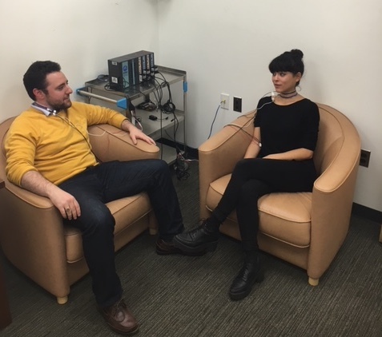
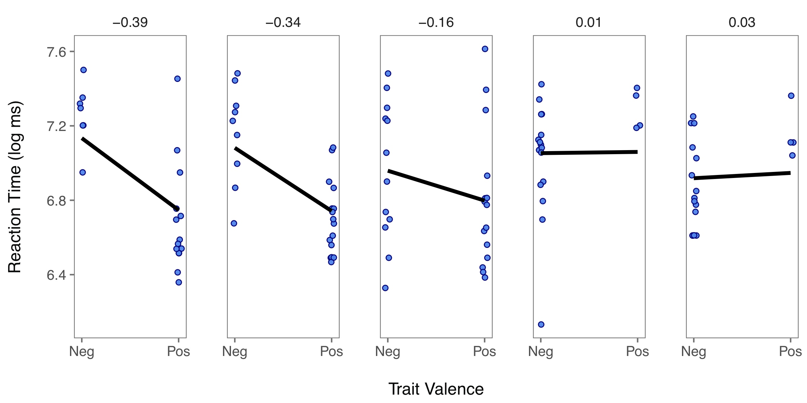
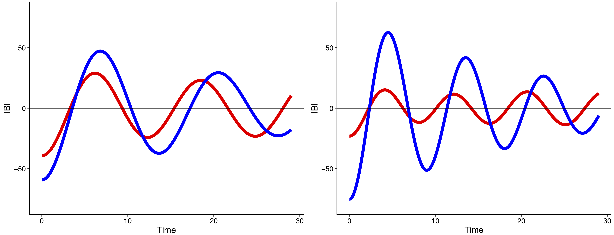

---
title: "Research"
output: 
  html_document:
    toc: false
    toc_float: false
    includes:
      after_body: footer.html
---

<font size="3"> 

<br>

### *"Life has no blessing like a wise friend."  - Euripides*

My research investigates how and why social relationships benefit well-being. My work is driven by three questions. First, how do relationship partners support each other effectively in times of difficulty? Second, what role do relationship partners play in fostering effective self-regulation across the lifespan? And third, how do partners within a dyad regulate as a unit? To answer these questions, my work synthesizes literatures on close relationships, self-regulation, and lifespan development in novel ways, spans multiple levels of analysis, and uses a range of methods, including experiments, psychophysiology, and daily diaries. In my empirical work, I draw on and develop the best statistical methods available to address my theoretical aims. 

<br>

## Social Support Effectiveness
Although it is often assumed that social support (practical and emotional help from others) underlies the health-promoting effects of relationships, empirical evidence for this assumption has been mixed. Receiving support has sometimes been linked to reduced stress and lower mortality risk, suggesting that, if given appropriately, support may enable people to live longer, healthier lives. However, receiving support can also undermine recipients’ feelings of competence and worsen their distress. I have integrated theories of self-regulation and motivation to reconcile these mixed findings on the costs and benefits of support. Building on theories positing that effective support must address recipients’ needs, I have tackled the notion of addressing recipients’ needs in a novel way by proposing that support is most effective when it addresses recipients’ *self-regulatory* needs ([Zee, Cavallo, Flores, Bolger, & Higgins, 2018](https://psycnet.apa.org/fulltext/2018-03575-001.html){target="_blank"}; [Zee, Bolger, & Higgins, 2020](http://dx.doi.org/10.1037/pspi0000235){target="_blank"}; [Zee & Kumashiro, 2019](https://onlinelibrary.wiley.com/doi/full/10.1111/pere.12298){target="_blank"}; [Cavallo, Zee, & Higgins, 2016](https://journals.sagepub.com/doi/full/10.1177/0146167216651852); Cavallo, Zee, & Higgins, in preparation).

In one project, I found that recipients who received support given in a manner (*visible* vs. *invisible*; [Zee & Bolger, 2019, *Current Directions in Psychological Science*](https://doi.org/10.1177/0963721419835214){target="_blank"}) that matched their self-regulatory orientation felt less distressed, experienced higher self-efficacy, and showed tempered cardiovascular reactivity during a laboratory stressor [(Zee et al., 2018, *Journal of Personality and Social Psychology*)](https://psycnet.apa.org/fulltext/2018-03575-001.html){target="_blank"}.

In subsequent research, I developed a new construct to directly assess the degree to which social support is attuned to recipients’ self-regulatory needs [(Zee, Bolger & Higgins, 2020, *Journal of Personality and Social Psychology*)](http://dx.doi.org/10.1037/pspi0000235){target="_blank"}. I found that receiving support that better addressed recipients' self-regulatory needs was linked to outcomes that are important for effective self-regulation, such as lower negative mood, greater motivation to persist on a demanding task, and tempered cardiovascular stress. Moreover, receiving support that addressed their self-regulatory needs was linked to greater motivation to perform well on a stressful speech, which in turn predicted better objective speech performance. 
<br>
<br>
```{r couplespic, echo=FALSE, fig.cap=" ", out.width = '50%', fig.align='center'}
knitr::include_graphics("images/couplehugging.jpg")
```

<br>
<br>

## Social Relationships across the Lifespan
My research on social relationships and social support also extends to a lifespan context and examines the role of social relationships in promoting healthy aging. My work focuses on how relationship partners promote developmental regulation, which involves setting and pursuing goals that enable people to adapt to age-related changes across the lifespan. In one investigation, I found that although feeling younger than one's chronological age (a younger subjective age bias) is known to be associated with health benefits over time, the positive effects of a younger subjective bias are intesified among individuals in higher (vs. lower) quality marital relationships [(Zee & Weiss, 2019, *Psychology and Aging*)](https://psycnet.apa.org/fulltext/2019-25483-003.html){target="_blank"}. 

In a second project, I am currently examining older couples' dyadic support interactions leading up to a laboratory stressor, in order to examine the effects of support behaviors in mitigating stress reactivity in older adulthood and illuminate how older adults’ support interactions differ from those of younger adults. 
<br>
<br>
```{r agingpic, echo=FALSE, fig.cap=" ", out.width = '50%', fig.align='center'}

```

<br>
<br>

## Coregulation and Dyad as Unit of Analysis
In an additional stream of research, I examine dyad-level co-regulation. Co-regulation is a process in which changes in one person’s emotional or physiological state are dynamically influenced by both their own prior state and their partner’s state and is proposed to occur as a way of maintaining the emotional stability of the dyad. My current research examines when such co-regulatory processes become activated and what implications they have for individuals’ well-being ([Zee & Bolger, 2020, *Multivariate Behavioral Research*](https://www.tandfonline.com/doi/full/10.1080/00273171.2019.1699392); Zee & Bolger, in preparation){target="_blank"}. 

<br>
```{r coregpic, echo=FALSE, fig.cap=" ", out.width = '50%', fig.align='center'}

```

<br>
<br>


## Statistical Methods
I develop and implement novel statistical methods to better address my research aims on interpersonal relationships and regulatory processes. First, my work involves modeling and interpreting between-subject heterogeneity in experimental and non-experimental effects. Between-subject heterogeneity refers to the notion that subjects differ in the extent to which they show a "typical" effect; some may show especially strong effects, whereas others may show weak effects or even a reversal in the direction of their effect. In one project, my colleagues and I proposed the importance of working from the assumption that causal processes are heterogeneous and highlighted the utility of multilevel modeling (in particular, random effects) for examining heterogeneity directly [(Bolger, Zee, Rossignac-Milon, & Hassin, 2019, *Journal of Experimental Psychology: General*)](https://psycnet.apa.org/fulltext/2019-19962-002.html){target="_blank"}. We revealed that noteworthy between-subject heterogeneity is often present, even in tightly controlled experiments. I have also used random effects to examine sources of heterogeneity beyond subject-level heterogeneity. For example, I have developed a way of summarizing complex results across outcomes and datasets by treating the outcomes and datasets as crossed random effects, while also assessing the degree of heterogeneity in both influences ([Zee et al., 2020](http://dx.doi.org/10.1037/pspi0000235){target="_blank"}; Zee & Bolger, in preparation). 
<br>
<br>
```{r heterogeneity, echo=FALSE, fig.cap="Panel plots showing between-subject heterogeneity in experimental effects for five subjects. Reproduced from Bolger, Zee, et al. (2019). *Journal of Experimental Psychology: General.*", out.width = '70%', fig.align='center'}

```

<br>

Second, I combine dyadic analyses and time series analyses to model temporal dynamics in interpersonal processes. Much of my work in this area has focused on dynamical systems modeling, in particular coupled oscillator models. These models offer valuable insight into temporal processes by capturing the rate of change (velocity) and speed of change (acceleration) in individuals’ or dyads’ responses, and into regulatory processes by capturing fluctuations around an equilibrium level. I have used these models to study coregulatory dynamics in physiological responses during couples’ laboratory discussions ([Zee & Bolger, 2020, *Multivariate Behavioral Research*](https://www.tandfonline.com/doi/full/10.1080/00273171.2019.1699392); Zee & Bolger, in preparation){target="_blank"}. <br>
<br>
```{r dsmpic, echo=FALSE, fig.cap="Example results from dynamical systems analysis of dyadic physiological data.", out.width = '70%', fig.align='center'}

```

<br>

</font> 